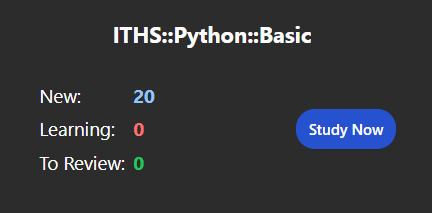

## Table of Contents
 
1. [Setup]()  
   1. [Anki Setup]()  
   2. [Download Cards]()  
   3. [Import Cards to Anki]()  
2. [Using Anki]()  
   1. [Useful Settings]()  
   2. [Custom Study]()  
3. [Contributing]()  
   1. [Making Cards]()  
   2. [Sharing Cards]()  
   3. [Feedback and Issues]()  
4. [Science of Flashcards]()  
   1. [Active Recall]()  
   2. [Spaced Repetition]()  

# Setup  

To get started using digital flashcards you need a program for reviewing. Any program will work, but the notes here are formatted to import and use directly with Anki.  

 

## Anki Setup  

There are several versions of Anki to use:  
 - Anki for desktop  
 - AnkiDroid for Android  
 - AnkiMobile for iPhone (paid app, use AnkiWeb as a free alternative)  
 - AnkiWeb for browser based version (also handles syncing between devices)  

The recommended approach is to handle all imports and exports using the desktop version of Anki and then sync to your app of choice using AnkiWeb.  

 

Download: [Anki for desktop](https://apps.ankiweb.net/)  
Install and make sure to select English as language  

To sync cards between devices you need AnkiWeb  
Create: [AnkiWeb account](https://ankiweb.net/about)  

In Anki, click "Sync" and enter your information  
*ID and password is your email and password used to sign up on AnkiWeb*  
  

Any changes you make will now be synced to your AnkiWeb account. This includes any cards or decks you import or create, as well as your review history.  

To sync to another version of Anki, simply repeat the same steps of installing and syncing to your AnkiWeb account.

 

## Download Cards  

Download directly from GitHub:  
1. Click the flashcards.txt file  
2. Click "Download raw file" on the right-hand side  

  

 

## Import Cards to Anki  

Import cards in Anki desktop app:  
 - Go to  File > Import  
 - Select the flashcards.txt file  
 - Check that everything looks right before clicking Import  

  

 

# Using Anki  

Studying with Anki is very straight-forward, but there are a few things to be aware of to optimize your learning experience.  

#### Selecting a Deck  

The cards are all located in a main deck with course decks divided into different levels of difficulty or how early in the course you are likely to encounter a subject.   

  

When studying you can:  
1. Click the main deck to study all cards from all courses  
2. Click a course deck to study all cards from that corse  
3. Click a course subdeck to study cards in that course of that difficulty  

  

 

#### Starting a Study Session

When starting a study session you get an overview of what cards will be included in the session. You can interrupt your session at any point and return later, and it will pick up from where you last were. Click "Study Now" to get started.  

  

 

#### Card Front

For each card in the study session you will first be presented with the front of the card which contains a question or concept.  

To the best of your ability, try to guess or remember what is written on the backside of the card and then click Show Answer.  

  

 

#### Card Back

The back of a card contains an answer or explanation to the front. In this case, what the function abs() does, it returns the absolute value of a number x.  

Based on how well you guessed or remembered this information, grade the card from Again to Easy. Based on your grading, the card will be scheduled for reviewing again later.  

The more times you review a card, and the easier you grade it, the longer it will take before the card appears again. A built-in algorithm tries to predict when you are likely to forget the information and schedules it for review slightly before this happens. Because of this, it's important to do your reviews daily in order to be reminded of information before you forget it.

  

 

## Useful Settings  

Default settings in Anki should generally not be changed, it automatically handles everything for you, but there are some important settings to look over when it comes to how much time you want to spend reviewing each day.
 

#### New cards/day (default 20)  

How many NEW cards are scheduled for review each day. 20 cards per day takes no time at all, but because cards are scheduled to appear again after studying, this number will grow over time as long as there are more new cards to introduce, until hitting a cap around a few hundred cards per day.  

This won't be an issue when studying only from this deck, but if you want to study from other decks alongside this it's important to keep this limit in mind.  
 

#### Maximum reviews/day (default 200)  

How many cards can be scheduled for review in a given day at MOST. This can be a useful setting if you are worried about cards piling up too quickly. It's important to not fall behind in your reviews, so setting this to a realistic value is important for not getting overwhelmed, losing motivation, and forgetting everything you learned.  

*To open this window, simply click on Options from the home screen of the app*  
  

 

## Custom Study  

When starting a study session there is a Custom Study button at the bottom. Using a custom study it's possible to set up a cram session just before a test, review cards with a specific tag, or any other kind of study you want.  

Usually Anki handles sessions well by default, but custom study is an important tool to be aware of. I won't go into detail on it here since there is so much you can do with it, but there is plenty of information online and in the [Anki Manual](https://docs.ankiweb.net/filtered-decks.html)

  

 

# Contributing  

Please contribute to this repository by making your own cards in Anki of things you come across and sharing it with everyone else!  

## Making Cards  

To add cards to your deck, click Add at the top of the home screen and fill in the card information:  

#### Type  
How the card will be presented when reviewing  

Basic   
The default with a question/statement on the front and answer/explanation on the back  

Basic (and reversed card)  
Creates two cards, one going front to back and one going back to front. Use this for cards that work both ways  

For example:
*abs(x) ↔ return the absolute value of a number x*  
Front to back: see a function, explain what it does  
Back to front: see a desired outcome, explain which function to use for it  

#### Deck  
Which deck to put the card in  
Always put cards in bottom level subdecks, this will make it easier to structure your studies. For example in ITHS::Python::Basic instead of in ITHS::Python  

#### Front / Back  
Question or statement / answer or explanation  

#### Tags  
Descriptive terms to search and filter cards by  

For example:  
Function - Card explaining how to use a function  
Syntax - Card explaining how to write code  

This way you can target study functions by filtering out the function tag and so on

  

 

## Sharing Cards  

Please share your cards by adding them to this repository for everyone to access. To do so, simply make a pull request with your own exported version of the deck added.  

To be added: how to make a pull request  

## Feedback and Issues  

To be added: how to create issues on github  
Until implemented, either search for it on your own or send me a message directly and I will look at it!

# Science of Flashcards  

upcoming  

##  Active Recall  

link to video  

## Spaced Repetition  

link to video  

